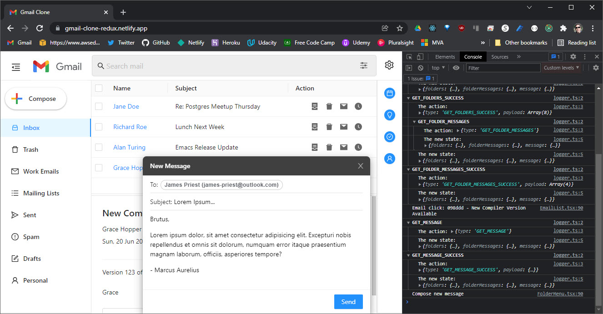

[](https://app.netlify.com/sites/gmail-clone-redux/deploys)

**Live Demo:** [https://gmail-clone-redux.netlify.app](https://gmail-clone-redux.netlify.app/)

# Gmail Clone (React/Redux)

This is a mock-up of the Gmail frontend. It was given as a coding exercise under a limited amount of time. The [assignment](public/docs/Technical-Interview-Frontend.pdf) was to create a frontend from scratch and populate it with data from a supplied set of JSON files.



The project has the following features:

- Mock up fetch and API endpoints using Promises and async/await.
- Use of Typescript and Create-React-App for build environment.
- Use of Ant Design component library.
- Use of Redux for global state management.
- Use of Redux Thunk for Async API calls.

## Installation

Clone the repository.

```bs
git clone https://github.com/james-priest/gmail-clone.git
cd gmail-clone
```

Use yarn or npm to install dependencies.

```sh
yarn

# or

npm install
```

## Usage

### Development mode

- Starts a dev server.
- Bundles but does not optimize or minify.
- Launches website at [http://localhost:3000/](http://localhost:3000/).

```sh
yarn start

# or

npm run start
```

### Production mode

- Will build once (No watch mode or hot module replacement).
- Minifies html, js, css, and optimizes image resources.
- Outputs to `build/`.

```sh
yarn build

# or

npm run build
```

In order to view the production version a local http server needs to be used to launch `dist/index.html` .

Here are two links showing how to spin up a local http server.

- [Simple HTTP Server](http://jasonwatmore.com/post/2016/06/22/nodejs-setup-simple-http-server-local-web-server) - Runs on Node.js.
- [How to run things locally](https://threejs.org/docs/#manual/en/introduction/How-to-run-things-locally) - Instructions for Node.js, Python, & Ruby.

Alternatively, a Visual Studio Code extension can be used to run the site from within the VSCode dev environment.

- [Live Server](https://marketplace.visualstudio.com/items?itemName=ritwickdey.LiveServer) - Launch a development local Server with live reload feature for static & dynamic pages.

## Development Process

I divided my time into 3 phases:

1. Research
   - Evaluate frameworks and component libraries for best fit.
   - Decide which features to include in the UI.
   - Determine which state management option to use (e.g. component state, context, redux, etc.).
2. Planning
   - Mockup the page view.
   - Split view up into hierarchy of components.
   - Determine application events.
   - Determine what data should live in the store.
3. Coding
   - Code mock-up of fetch and data access endpoints.
   - Code UI, components, and component interactions.
   - Code state management.
